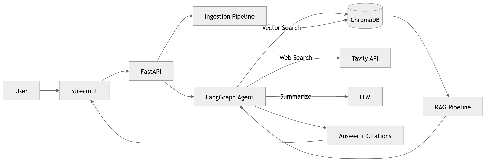

# AI Company Research Agent

> **Production-grade RAG application with autonomous agent capabilities.**
> Ingests company data from web and PDFs, enables natural-language Q&A with source-cited answers, and autonomously decides which tools to use — powered by LangChain, LangGraph, ChromaDB, FastAPI, and Streamlit.

<br>

## Quick Start

```bash
# Terminal 1 — API backend
python -m uvicorn src.api.main:app --port 8080

# Terminal 2 — UI
python -m streamlit run src/ui/app.py --server.port 8888
```

Open `http://localhost:8888`

<br>

## What It Does

You type a company name. The agent:

1. **Scrapes** Wikipedia and the company's official website
2. **Chunks** the text into semantically meaningful pieces (800 chars, 100 overlap)
3. **Embeds** every chunk into 384-dimensional vectors using `all-MiniLM-L6-v2`
4. **Stores** everything in ChromaDB with rich metadata (source, page, date)
5. **Answers** natural-language questions using MMR retrieval + GPT-4o-mini generation
6. **Cites** every factual claim with numbered references `[1]`, `[2]`, `[3]`

The autonomous LangGraph agent decides on its own which tools to use:

- **Vector search** → for questions about ingested company data
- **Live web search** → for recent news or unknown companies
- **Summarizer** → when retrieved content needs condensing
- **Ingestion trigger** → when a new company needs to be added

No manual tool selection. The LLM reasons and decides.

<br>

## Architecture



### Layer Breakdown

| Layer | Components | Responsibility |
|-------|-----------|----------------|
| **Ingestion** | `web_scraper`, `pdf_processor`, `chunker`, `embedder`, `vector_store`, `pipeline` | Collect, process, embed, store |
| **RAG** | `retriever`, `generator`, `chain` | MMR retrieval + cited generation |
| **Agent** | `graph`, `tools`, `state`, `prompts` | Autonomous tool orchestration |
| **API** | `main`, `routes`, `schemas`, `dependencies` | REST interface with Pydantic validation |
| **UI** | `app`, `components` | Professional Streamlit frontend |

<br>

## Tech Stack

| Category | Technology | Reason |
|----------|-----------|--------|
| **LLM Framework** | LangChain 0.3+ | Industry standard, 60%+ of French AI job posts |
| **Agent Orchestration** | LangGraph | Production ReAct agents with state machines |
| **Vector Database** | ChromaDB | Local, persistent, zero infrastructure |
| **Embeddings** | sentence-transformers `all-MiniLM-L6-v2` | Free, 384d, runs on CPU |
| **LLM** | GPT-4o-mini | Cost-effective, fast, high quality |
| **Web Search** | Tavily API | Built for AI agents, free tier |
| **PDF Processing** | PyMuPDF (fitz) | Fast page-by-page extraction with metadata |
| **Web Scraping** | httpx + BeautifulSoup + wikipedia-api | Async HTTP + clean HTML parsing |
| **API Framework** | FastAPI | Async, auto-docs, Pydantic validation |
| **Frontend** | Streamlit | Professional dark-theme UI |
| **Data Validation** | Pydantic v2 | Type-safe request/response models |
| **Configuration** | Pydantic BaseSettings | 12-factor app config, env-based |
| **Logging** | Loguru | Structured, readable logs |

<br>

## Key Technical Decisions

### Why RAG instead of fine-tuning?
Fine-tuning is expensive, slow, and goes stale. RAG stays current (re-ingest anytime), is explainable via citations, and costs near zero. For company research where facts change quarterly RAG is the correct choice.

### Why LangGraph instead of simple chains?
Simple chains run linearly. LangGraph supports **loops, conditional branching, and persistent state** essential for an agent that may need to call 2–3 tools before it has enough context to answer. The `should_continue` conditional edge drives the ReAct loop automatically.

### Why MMR retrieval?
Standard similarity search returns the N most similar chunks  which are often near-duplicates (same paragraph, slightly reworded). **Maximal Marginal Relevance** picks chunks that are relevant to the query AND diverse from each other, giving the LLM richer context without redundancy. Lambda=0.6 gives a 60/40 relevance-diversity split.

### Why one ChromaDB collection per company?
Scoping queries to a single collection is faster and more precise than filtering one giant collection by metadata. Adding a new company never affects existing data.

<br>

## Project Structure

```
ai-company-research-agent/
│
├── src/
│   ├── config.py                    # Pydantic BaseSettings — all config in one place
│   │
│   ├── ingestion/                   # Layer 1: Data Pipeline
│   │   ├── web_scraper.py           # Async httpx + Wikipedia API + BeautifulSoup
│   │   ├── pdf_processor.py         # PyMuPDF — page-by-page with metadata
│   │   ├── chunker.py               # RecursiveCharacterTextSplitter (800/100)
│   │   ├── embedder.py              # sentence-transformers all-MiniLM-L6-v2
│   │   ├── vector_store.py          # ChromaDB CRUD — cosine similarity, per-company
│   │   └── pipeline.py              # Orchestrator → returns IngestionReport
│   │
│   ├── rag/                         # Layer 2: Retrieval-Augmented Generation
│   │   ├── retriever.py             # MMR + similarity search, retrieve_with_context()
│   │   ├── generator.py             # GPT-4o-mini, temperature=0, citation extraction
│   │   └── chain.py                 # RAGChain: retrieve → generate → GeneratedAnswer
│   │
│   ├── agent/                       # Layer 3: Autonomous Agent
│   │   ├── state.py                 # AgentState TypedDict with operator.add messages
│   │   ├── prompts.py               # System prompt — tool selection strategy
│   │   ├── tools.py                 # @tool: vector_search, web_search, summarize, ingest
│   │   └── graph.py                 # StateGraph, ToolNode, conditional edges
│   │
│   ├── api/                         # Layer 4: FastAPI Backend
│   │   ├── main.py                  # App factory, lifespan startup, CORS
│   │   ├── routes.py                # /ingest /query /companies /health
│   │   ├── schemas.py               # Pydantic request/response models
│   │   └── dependencies.py          # lru_cache singletons — embedder loads once
│   │
│   └── ui/                          # Layer 5: Streamlit Frontend
│       ├── app.py                   # Pages: Research, Companies, About
│       └── components.py            # Reusable UI components
│
├── tests/
│   ├── conftest.py
│   ├── test_ingestion.py
│   ├── test_retriever.py
│   ├── test_agent.py
│   └── test_api.py
│
├── data/
│   ├── chromadb/                    # Persistent vector store (gitignored)
│   └── sample_pdfs/                 # Demo company reports
│
├── .streamlit/
│   └── config.toml                  # Dark theme, server config
│
├── pyproject.toml                   # Dependencies + project metadata (PEP 517)
├── .env.example                     # API key template
└── .gitignore
```

<br>

## API Reference

### `POST /api/v1/ingest`
Scrape and store a company into the knowledge base.

```json
// Request
{
  "company_name": "TotalEnergies",
  "company_url": "https://www.totalenergies.com",
  "replace_existing": false
}

// Response
{
  "success": true,
  "company_name": "TotalEnergies",
  "chunks_stored": 142,
  "characters_processed": 89341,
  "duration_seconds": 8.4,
  "errors": []
}
```

### `POST /api/v1/query`
Ask a question — the agent autonomously selects tools and returns a cited answer.

```json
// Request
{
  "company_name": "TotalEnergies",
  "question": "What is TotalEnergies strategy for renewable energy?"
}

// Response
{
  "answer": "TotalEnergies has committed to reaching net-zero emissions by 2050 [1][2]...",
  "citations": [
    {
      "number": 1,
      "source": "https://en.wikipedia.org/wiki/TotalEnergies",
      "title": "TotalEnergies",
      "relevance_score": 0.72
    }
  ],
  "confidence": 0.71,
  "tool_calls_made": 1,
  "had_enough_context": true
}
```

### `GET /api/v1/companies`
List all ingested companies with chunk counts.

### `DELETE /api/v1/companies/{name}`
Remove a company and all its data from ChromaDB.

### `GET /api/v1/health`
Health check — returns model name and version.

**Interactive docs available at:** `http://localhost:8080/docs`

<br>

## Setup

### Prerequisites
- Python 3.11+
- OpenAI API key (~$2–5 for the entire project)
- Tavily API key (free tier — 1000 searches/month at [app.tavily.com](https://app.tavily.com))

### Installation

```bash
# 1. Clone
git clone https://github.com/Rehan253/AI-Company-Research-Agent.git
cd AI-Company-Research-Agent

# 2. Virtual environment
python -m venv .venv
.venv\Scripts\Activate.ps1        # Windows PowerShell
# source .venv/bin/activate       # Linux / Mac

# 3. Install all dependencies
pip install -e ".[dev]"

# 4. Configure API keys
cp .env.example .env
# Open .env and add your OPENAI_API_KEY and TAVILY_API_KEY
```

### Environment Variables

```env
OPENAI_API_KEY=sk-...
TAVILY_API_KEY=tvly-...
CHROMA_PERSIST_DIR=./data/chromadb
EMBEDDING_MODEL=all-MiniLM-L6-v2
LLM_MODEL=gpt-4o-mini
CHUNK_SIZE=800
CHUNK_OVERLAP=100
```

### Zero-cost alternative
Replace OpenAI with [Ollama](https://ollama.ai) (local LLM) and Tavily with DuckDuckGo search. The entire project runs offline at $0.

<br>

## Agent Behavior Examples

| Question | Tool chosen | Why |
|----------|------------|-----|
| "Who founded Danone?" | `vector_search` | Company is ingested — use knowledge base |
| "What is the latest news about LVMH in 2025?" | `web_search` | "Latest" = current info needed |
| "Tell me about Mistral AI" | `web_search` | Company not ingested |
| "Summarize TotalEnergies strategy" | `vector_search` → `summarize_text` | Retrieved text needs condensing |
| "Research Airbus for me" | `ingest_company` → `vector_search` | New company, trigger ingestion first |

<br>

## Estimated Cost

| Resource | Cost |
|---------|------|
| OpenAI GPT-4o-mini | ~$2–5 total for full development |
| Tavily API | Free (1,000 searches/month) |
| sentence-transformers | Free — runs locally on CPU |
| ChromaDB | Free — runs locally |
| **Total** | **$2–5** |

<br>

## Skills Demonstrated

**AI / ML**
- End-to-end Retrieval-Augmented Generation (RAG) pipeline
- Autonomous AI agents with LangGraph (ReAct pattern)
- Vector embeddings and semantic similarity search
- Maximal Marginal Relevance (MMR) for diverse retrieval
- LLM prompt engineering — citation grounding, hallucination prevention
- Multi-source data ingestion (web scraping, PDF extraction, live search)

**Software Engineering**
- Async Python (`asyncio`, `httpx`) for concurrent web scraping
- FastAPI with Pydantic v2 — fully typed REST API
- Dependency injection with `lru_cache` — embedding model loads once
- 12-factor app configuration with Pydantic BaseSettings
- Modular architecture — every layer independently testable and replaceable

**Data Engineering**
- Chunking strategy (size vs overlap trade-offs for retrieval quality)
- Vector database design (per-company collections for query isolation)
- Metadata preservation through the full ingestion → retrieval pipeline
- Page-level PDF extraction with citation-ready metadata

<br>


<br>

## Author

**Rehan Shafique**
AI Engineer · France 🇫🇷

---

*Built from scratch Every component  from the async web scraper to the LangGraph ReAct agent  was designed and implemented with production engineering practices in mind.*
